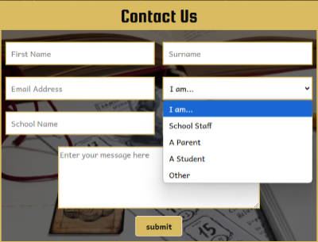

# **Gameracy Outreach Programme**
 
[View the live project here](http://www.project.com)

This website has been created as a project during my [Code Institute](https://codeinstitute.net/) Level 5 Web App Development course. 

---
## **Table of Contents**
* [Inspiration](#inspiration)
* [Website Goals](#website-goals)
* [User Experience](#user-experience-ux)
    * [Types of Users](#types-of-users)
    * [User Stories](#user-stories)
* [Design](#design)
    * [Colour Scheme](#colour-scheme)
    * [Typography](#typography)
    * [Imagery](#imagery)
    * [Wireframes](#wireframes)
* [Features](#features)
    * [Responsiveness](#responsiveness)
    * [Header](#header)
    * [Footer](#footer)
    * [Interactive Elements](#interactive-elements)
    * [Contact Form](#contact-form)
* [Future Features](#future-features)
* [Testing]()
    * [User Story Testing]()
    * [Automated Testing]()
        * [The W3C Markup Validation Service]()
        * [The W3C CSS Validation Service]()
        * [The WAVE Webb Accessibility Evalusation Tool]()
    * [Chrome Lighthouse]()
    * [Manual Testing]()
        * [Features]()
        * [Browser]()
        * [Responsiveness]()
* [Technologies and Languages](#technologies-used)
    * [Languages](#languages)
    * [Frameworks, Libraries and Programs](#frameworks-libraries--programs)
* [Deployment]()
* [Credits]()

## **Inspiration**
I work in a library at an FE college where I run an award-winning tabletop gaming programme for disengaged 14-18 year olds. 
The programme is called Gameracy and it helps students to improve literacy, numeracy, teamwork and strategy skills by playing tabletop games to take the stress out of learning.
Inspired by my desire to one day  offer Gameracy as an outreach programme in other educational establishments, I have created this website to be the main marketing and sign-up tool should this dream ever come to fruition.

The outreach programme's website was designed hugely with accessibility in mind, as this is something I feel very strongly about. 
It was also designed to be responsive across mobiles, tablets and desktop screens, making it easy to navigate for potential customers.

---

## **Website Goals**
* Inform potential customers of what Gameracy is
* Clearly outline the benefits of tabletop gaming
* Make it easy to find what services are on offer
* Ensure that potential customers can convert into actual customers by easily being able to contact me

---

## **User Experience (UX)**

### Types of Users
* School staff who know nothing about Gameracy and want to find out more
* School staff who know about Gameracy and want to find out how to book in
* Parents who want to see what their children will gain from participating in gaming events/curriculum
* Parents who have heard about Gameracy and want to register interest for their child's school
* Students wanting to see what Gameracy is about, what they will play and why

### User Stories
#### First Time Visitor Goals
* As a first-time visitor I want to easily understand the purpose of the website, the organisation, and the benefits its services offer
* I want to navigate the website easily, with a clear, logical structure to find content
* I want to view testimonials or reviews to understand what existing customers think of the organisation and its services
* I want to locate the organisation's social media links to view their followings and see if their content is appropriate
#### Returning Visitor Goals
* As a returning visitor, I want to easily locate the different types of services and understand the cost implications
* I want to easily find a way to contact the organisation for more information, to register interest, and with any questions I might have
* I want to see what games are involved in each service and why they have been chosen
* I want to easily find out how to book in for the services on offer

## **Design**
### Colour Scheme
* The Gameracy logo  was dropped into [Adobe Colour](https://color.adobe.com/create/image) and the following colour palette was created:   
  
* After using [webAIM's contrast checker](https://webaim.org/resources/contrastchecker/) to check for appropriate background/foreground contrast ratios, I chose to use a combination of:
    * Misted Yellow: \#D9BB62
    * White Smoke: \#F2F2F2
    * Smoky Black: \#0D0D0D
### Typography
* I used [fontjoy.com](http://www.fontjoy.com) to generate a scheme of fonts that go well together, that are accessible, and that are attractive.
I took a little time with this because I didn't want fonts that contained double-storey letters, as they can be harder for people with specific learning difficulties to process.
    * I chose Cardo for my main Gameracy title that will sit in the header. It's fancy enough to convey a fantasy-genre feel without being too calligraphic, and is a sans-serif font, which is recommended for accessibility. It is bold and italic to make it stand out even more.
    * Fontjoy suggested Squada One for headings, another sans-serif font which contrasts nicely with Cardo.
    * Andika was chosen for the paragraph and nav bar text, as it is a sans-serif font that has been optimised for use as a literacy font, fitting with one of Gameracy's main objectives, which is to improve literacy.
* I used [Font Awesome](https://fontawesome.com/) to generate D20 dice to use as bulletpoints, I styled these in Misted Yellow.
### Imagery
* The hero image needed to be representative of tabletop gaming and literacy. 
I also wanted it to have some colours that matched with the Gameracy logo, so I spent some time browsing through [freepik.com](https://www.freepik.com/). The image I decided upon was visually attractive, matched the site's colour scheme, and contained all the desired elements that embody Gameracy: gaming, books and writing implements.
* Once the hero image had been chosen I was able to select further images from the 'similar to...' option on [freepik.com](http://www.freepik.com) that were in keeping with the website's design and ensuring that they looked thematically similar to each other.
* There were many images of the games to choose from, but I decided upon high-quality, small-size images that showcased each game's components in the best light to illustrate how engaging and fun the games are. It was especially important to me to highlight any miniatures the games possessed, as our current students who take part in Gameracy love them so much and they provide an extra layer of immersion to the experience.
* All images have been saved as avif filetypes, which uses a codec to compress the images without sacrificing quality.
### Wireframes
I created my wireframes using [moqups.com](https://moqups.com) - a streamlined and intuitive online app that lets you create wireframes and prototypes with lots of pre-created, drag-and-drop elements elements for a professional feel. I created a wireframe for each page for mobiles, tablets and desktops so that I could consult my design at any time and remind myself how I wanted it to reflow and restructure as screen sizes changed
* [Mobile Homepage Wireframe](https://app.moqups.com/Wpx0gxFP8oTFwRA3hAv52TdenYCYANd4/view/page/ad64222d5?ui=0)
* [Mobiles Games Wireframe](https://app.moqups.com/Wpx0gxFP8oTFwRA3hAv52TdenYCYANd4/view/page/afebc992c?ui=0)
* [Mobile Contact Us Wireframe](https://app.moqups.com/Wpx0gxFP8oTFwRA3hAv52TdenYCYANd4/view/page/aa97883ea?ui=0)
* [Tablet Homepage Wireframe](https://app.moqups.com/Wpx0gxFP8oTFwRA3hAv52TdenYCYANd4/view/page/ad4f38ebc?ui=0)
* [Tablet Games Wireframe](https://app.moqups.com/Wpx0gxFP8oTFwRA3hAv52TdenYCYANd4/view/page/a0d322815?ui=0)
* [Tablet Contact Us Wireframe](https://app.moqups.com/Wpx0gxFP8oTFwRA3hAv52TdenYCYANd4/view/page/af3a406c7?ui=0)
* [Desktop Homepage Wireframe](https://app.moqups.com/Wpx0gxFP8oTFwRA3hAv52TdenYCYANd4/view/page/a5114d6fa?ui=0)
* [Desktop Games Wireframe](https://app.moqups.com/Wpx0gxFP8oTFwRA3hAv52TdenYCYANd4/view/page/a84a8febe?ui=0)
* [Desktop Contact Us Wireframe](https://app.moqups.com/Wpx0gxFP8oTFwRA3hAv52TdenYCYANd4/view/page/a1bdbf46b?ui=0)

---

## **Features**
### Responsiveness
The Gameracy website has been designed mobile-first, built initially to look good on a screen 320px wide in Google Chrome. It is responsive across various screens and devices up to 4k (2560+). This has been achieved using Bootstrap grid sizes as well as CSS3 media queries to ensure the layout changes appropriately and reflows in an attractive manner when the screen is resized. Depending on the screen size, styles and images will also appear/disappear to ensure that the site looks clean and clutter-free on smaller screens, but the empty space is filled and interesting on larger screens.
### Header
* The header consists of a navbrand on the left with the Gameracy logo and name (font: Cardo), and a navbar on the right. 
* Clicking on the word 'Gameracy' will always bring the user back to the home page. 
* The navbar on the right collapses on mobile screens to become a burger icon that opens and closes a vertical dropdown nav. 
* The original wireframe had each nav-link with an outline box of Misted Yellow, but the final design does not, as it looks cleaner without it. 
* Each nav-link (font: Andika) has a hover colour and an active colour; the text changes color accordingly to keep the contrast ratio accessible.
* The header is sticky, so that whenever the user scrolls they will always have access to the navbar.

### Footer
The footer contains links to my different social media platforms (or will when I have them) and remains sticky so that when users scroll, they always have access to click on each platform and find out more about me and my business, and what other people think of Gameracy.

### Interactive Elements
Interactivity has been achieved by ensuring that effects are applied when certain elements are hovered over, such as the nav links, the social media icons, and any buttons that appear. I ensured that the hover effect colours were in keeping with the overall colour scheme of the site and that text colour changed to keep the contrast ratios accessible.

 

### Contact Form
The contact form has been built with several different types of fields, including dropdowns for any type of potential customer to be able to select themselves and the exact queries they want to send through to me and my company. They can use the form to make booking enquiries and will be taken to a success page after clicking the submit button. Some fields are required and others are not.

 

---

## **Future Features**
In the future I would like to implement the following features:
* An interactive booking system with a calendar, and list of services that allows school staff to directly book in. The services would be a lot more detailed, outlining clearly exactly what experience you are getting for your money.
* A login system so that only school staff can use the booking system
* On the games page I would like each card image to be replaced with a carousel, so that visitors can cycle through a collection of images showcasing each game in its full glory.
* I would also like to add audio to each game card, showcasing the sound effects and immersive theme tunes that accompany each gameplaying experience.
* I would like to add a testimonials section on the contact page, so that visitors can easily see and scroll through customer reviews about my company
* I would like to add information somewhere about myself as the founder and the award my programme won.
---

## **Technologies and Languages**
### Languages
* HTML5 - link this
* CSS3 - link this
### Frameworks, Libraries & Programs
1. Bootstrap
2. Google fonts
3. Font Awesome
4. Git
5. GitHub
6. Moqups
7. Favicon.io
8. Visual Studio Code