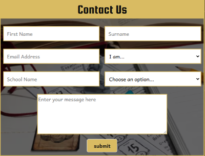
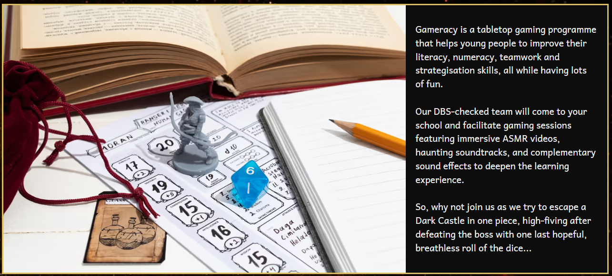
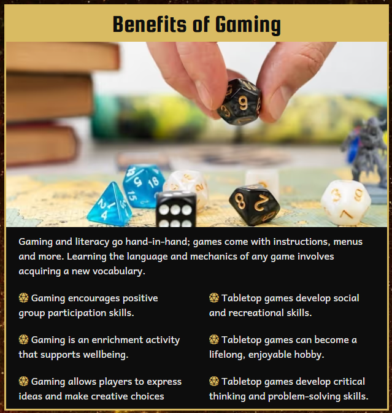
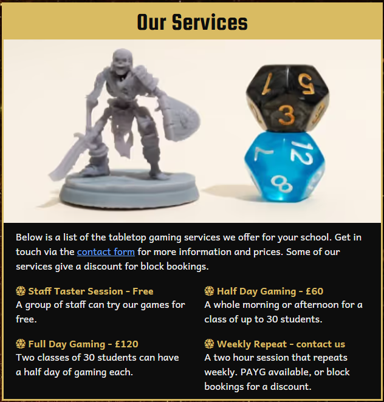
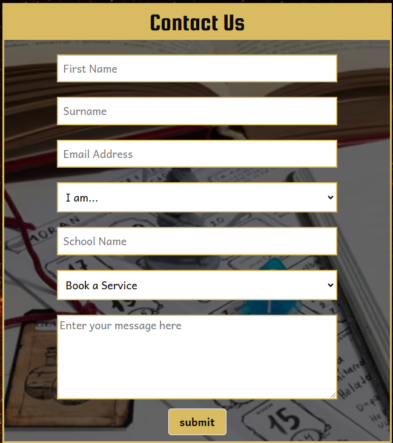
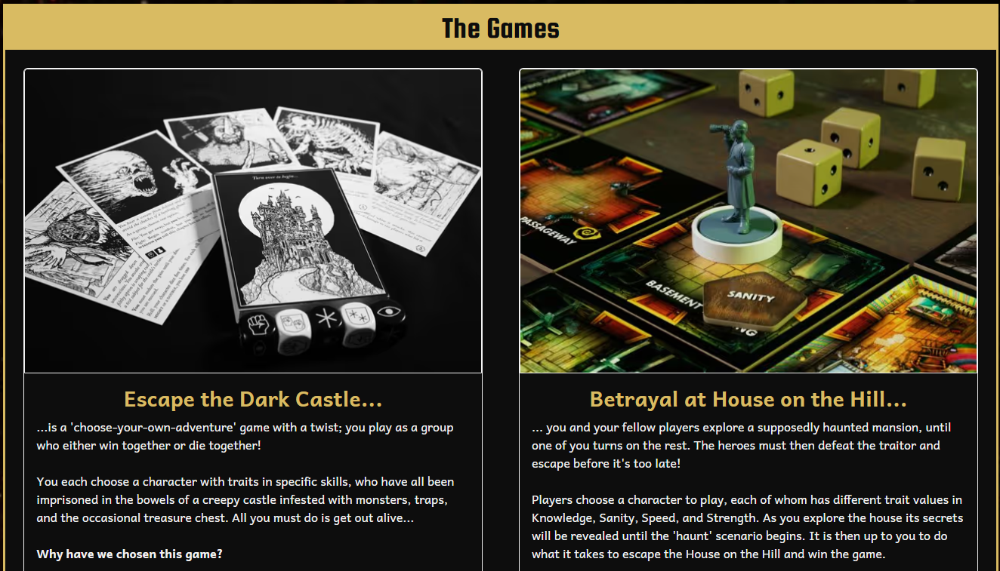
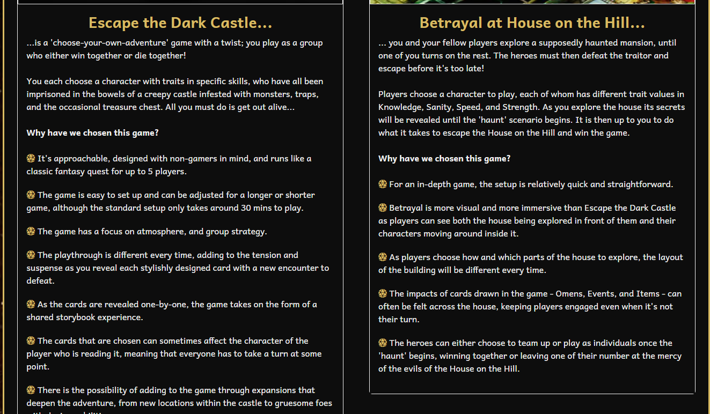

# **Gameracy Outreach Programme**
 
[View the live project here](https://nexiauk.github.io/Gameracy/)

This website has been created as a project during my [Code Institute](https://codeinstitute.net/) Level 5 Web App Development course. 

---
## **Table of Contents**
* [Inspiration](#inspiration)
* [Website Goals](#website-goals)
* [User Experience](#user-experience-ux)
    * [Types of Users](#types-of-users)
    * [User Stories](#user-stories)
* [Design](#design)
    * [Colour Scheme](#colour-scheme)
    * [Typography](#typography)
    * [Imagery](#imagery)
    * [Wireframes](#wireframes)
    * [End Product Design Changes](#end-product-design-changes)
* [Features](#features)
    * [Responsiveness](#responsiveness)
    * [Header](#header)
    * [Footer](#footer)
    * [Interactive Elements](#interactive-elements)
    * [Contact Form](#contact-form)
* [Future Features](#future-features)
* [Testing](#testing)
    * [User Story Testing](#user-story-testing)
    * [Automated Testing](#automated-testing)
        * [The W3C Markup Validation Service](#the-w3c-markup-validation-service)
        * [The W3C CSS Validation Service](#the-w3c-css-validation-service)
        * [The WAVE Web Accessibility Evaluation Tool](#the-wave-webb-accessibility-evaluation-tool)
        * [Chrome Lighthouse](#chrome-lighthouse)
    * [Manual Testing](#manual-testing---features-and-responsiveness)
    * [Bugs/Interesting Problems](#bugsinteresting-problems)
* [Technologies and Languages](#technologies-and-languages)
    * [Languages](#languages)
    * [Frameworks, Libraries and Programs](#frameworks-libraries--programs)
* [Deployment](#deployment)
    * [Creating a Fork](#creating-a-fork)
    * [Cloning a repository](#cloning-a-repository)
* [Credits](#credits)
    * [Media](#media)
    * [Code Help](#code-help)
    * [Acknowledgements](#acknowledgements)
    * [Creator Comment](#creator-comments)

## **Inspiration**
I work in a library at an FE college where I run an award-winning tabletop gaming programme for disengaged 14-18 year olds. 
The programme is called Gameracy and it helps students to improve literacy, numeracy, teamwork and strategy skills by playing tabletop games to take the stress out of learning.
Inspired by my desire to one day  offer Gameracy as an outreach programme in other educational establishments, I have created this website to be the main marketing and sign-up tool should this dream ever come to fruition.

The outreach programme's website was designed hugely with accessibility in mind, as this is something I feel very strongly about. 
It was also designed to be responsive across mobiles, tablets and desktop screens, making it easy to navigate for potential customers.

[Back to Table of Contents](#table-of-contents)

---

## **Website Goals**
* Inform potential customers of what Gameracy is
* Clearly outline the benefits of tabletop gaming
* Make it easy to find what services are on offer
* Ensure that potential customers can convert into actual customers by easily being able to contact me

[Back to Table of Contents](#table-of-contents)

---

## **User Experience (UX)**

### Types of Users
* School staff who know nothing about Gameracy and want to find out more
* School staff who know about Gameracy and want to find out how to book in
* Parents who want to see what their children will gain from participating in gaming events/curriculum
* Parents who have heard about Gameracy and want to register interest for their child's school
* Students wanting to see what Gameracy is about, what they will play and why

### User Stories
#### First Time Visitor Goals
* As a first-time visitor I want to easily understand the purpose of the website, the organisation, and the benefits its services offer
* I want to navigate the website easily, with a clear, logical structure to find content
* I want to view testimonials or reviews to understand what existing customers think of the organisation and its services
* I want to locate the organisation's social media links to view their followings and see if their content is appropriate
#### Returning Visitor Goals
* As a returning visitor, I want to easily locate the different types of services and understand the cost implications
* I want to easily find a way to contact the organisation for more information, to register interest, and with any questions I might have
* I want to see what games are involved in each service and why they have been chosen
* I want to easily find out how to book in for the services on offer

[Back to Table of Contents](#table-of-contents)

## **Design**
### Colour Scheme
* The Gameracy logo  was dropped into [Adobe Colour](https://color.adobe.com/create/image) and the following colour palette was created:   
  
* After using [webAIM's contrast checker](https://webaim.org/resources/contrastchecker/) to check for appropriate background/foreground contrast ratios, I chose to use a combination of:
    * Misted Yellow: \#D9BB62
    * White Smoke: \#F2F2F2
    * Smoky Black: \#0D0D0D
### Typography
* I used [fontjoy.com](http://www.fontjoy.com) to generate a scheme of fonts that go well together, that are accessible, and that are attractive.
I took a little time with this because I didn't want fonts that contained double-storey letters, as they can be harder for people with specific learning difficulties to process.
    * I chose Cardo for my main Gameracy title that will sit in the header. It's fancy enough to convey a fantasy-genre feel without being too calligraphic, and is a sans-serif font, which is recommended for accessibility. It is bold and italic to make it stand out even more.
    * Fontjoy suggested Squada One for headings, another sans-serif font which contrasts nicely with Cardo.
    * Andika was chosen for the paragraph and nav bar text, as it is a sans-serif font that has been optimised for use as a literacy font, fitting with one of Gameracy's main objectives, which is to improve literacy.
* I used [Font Awesome](https://fontawesome.com/) to generate D20 dice to use as bulletpoints, I styled these in Misted Yellow.
### Imagery
* The hero image needed to be representative of tabletop gaming and literacy. 
I also wanted it to have some colours that matched with the Gameracy logo, so I spent some time browsing through [freepik.com](https://www.freepik.com/). The image I decided upon was visually attractive, matched the site's colour scheme, and contained all the desired elements that embody Gameracy: gaming, books and writing implements.
* Once the hero image had been chosen I was able to select further images for the Benefits and Services sections, and for the success page. I used the the 'similar to...' option on [freepik.com](http://www.freepik.com), using the hero image as the staring point so I could choose images that were in keeping with the website's design and that looked thematically similar to each other.
* There were many images of the games themslves to choose from, but I decided upon high-quality, small-size images that showcased each game's components in the best light to illustrate how engaging and fun the games are. It was especially important to me to highlight any miniatures the games possessed, as our current students who take part in Gameracy love them so much and they provide an extra layer of immersion to the experience.
* All images have been saved as avif filetypes, which uses a codec to compress the images without sacrificing quality.
### Wireframes
I created my wireframes using [moqups.com](https://moqups.com) - a streamlined and intuitive online app that lets you create wireframes and prototypes with lots of pre-created, drag-and-drop elements for a professional feel. I created a wireframe for each page for mobiles, tablets and desktops so that I could consult my design at any time and remind myself how I wanted it to reflow and restructure as screen sizes changed:
* [Mobile Homepage Wireframe](https://app.moqups.com/Wpx0gxFP8oTFwRA3hAv52TdenYCYANd4/view/page/ad64222d5?ui=0)
* [Mobiles Games Wireframe](https://app.moqups.com/Wpx0gxFP8oTFwRA3hAv52TdenYCYANd4/view/page/afebc992c?ui=0)
* [Mobile Contact Us Wireframe](https://app.moqups.com/Wpx0gxFP8oTFwRA3hAv52TdenYCYANd4/view/page/aa97883ea?ui=0)
* [Tablet Homepage Wireframe](https://app.moqups.com/Wpx0gxFP8oTFwRA3hAv52TdenYCYANd4/view/page/ad4f38ebc?ui=0)
* [Tablet Games Wireframe](https://app.moqups.com/Wpx0gxFP8oTFwRA3hAv52TdenYCYANd4/view/page/a0d322815?ui=0)
* [Tablet Contact Us Wireframe](https://app.moqups.com/Wpx0gxFP8oTFwRA3hAv52TdenYCYANd4/view/page/af3a406c7?ui=0)
* [Desktop Homepage Wireframe](https://app.moqups.com/Wpx0gxFP8oTFwRA3hAv52TdenYCYANd4/view/page/a5114d6fa?ui=0)
* [Desktop Games Wireframe](https://app.moqups.com/Wpx0gxFP8oTFwRA3hAv52TdenYCYANd4/view/page/a84a8febe?ui=0)
* [Desktop Contact Us Wireframe](https://app.moqups.com/Wpx0gxFP8oTFwRA3hAv52TdenYCYANd4/view/page/a1bdbf46b?ui=0)

### End Product Design Changes
* Added a sparks background to fill the dead space on larger screen sizes. 
* Took the outline grid off the nav bar as it looked cleaner and less busy without it.
* Removed some images from index.html on mobile screen - these reappear on tablet size and above.
* Made a decision to keep the footer sticky on scrolling as well as the header, so that socials can be accessed at all times throughout the site.
* Added card and image outlines to the games on larger screens to keep them clearly delineated from each other. 
* Added hover effects to the submit and home buttons, as well as the socials icons.
* Added a success.html page that I hadn't accounted for in my initial wireframe designs - this launches after successfully submitting the contact form.
* Sourced and used D20 dice in font awesome to use as bulletpoints to the text. These weren't in the original designs.
* Created a favicon.

[Back to Table of Contents](#table-of-contents)

---

## **Features**
### Responsiveness
The Gameracy website has been designed mobile-first, built initially to look good on a screen 320px wide in Google Chrome. It is responsive across various screens and devices up to 4k (2560+). This has been achieved using Bootstrap grid sizes as well as CSS3 media queries to ensure the layout changes appropriately and reflows in an attractive manner when the screen is resized. Depending on the screen size, styles and images will also appear/disappear to ensure that the site looks clean and clutter-free on smaller screens, but the empty space is filled and interesting on larger screens.
### Header
* The header consists of a navbrand on the left with the Gameracy logo and name (font: Cardo), and a navbar on the right. 
* Clicking on the word 'Gameracy' will always bring the user back to the home page. 
* The navbar on the right collapses on mobile screens to become a burger icon that opens and closes a vertical dropdown nav. 
* The original wireframe had each nav-link with an outline box of Misted Yellow, but the final design does not, as it looks cleaner without it. 
* Each nav-link (font: Andika) has a hover colour and an active colour; the text changes color accordingly to keep the contrast ratio accessible.
* The header is sticky, so that whenever the user scrolls they will always have access to the navbar.

### Footer
The footer contains links to my different social media platforms (or will when I have them) and remains sticky so that when users scroll, they always have access to click on each platform and find out more about me and my business, and what other people think of Gameracy.

### Interactive Elements
Interactivity has been achieved by ensuring that effects are applied when certain elements are hovered over, such as the nav links, the social media icons, and any buttons that appear. I ensured that the hover effect colours were in keeping with the overall colour scheme of the site and that text colour changed to keep the contrast ratios accessible.

 

### Contact Form
The contact form has been built with several different types of fields, including dropdowns for any type of potential customer to be able to select themselves and the exact queries they want to send through to me and my company. They can use the form to make booking enquiries and will be taken to a success page after clicking the submit button. Some fields are required and others are not.

 

[Back to Table of Contents](#table-of-contents)

---

## **Future Features**
In the future I would like to implement the following features:
* The hero image being animated on the first visit to the site.
* An interactive booking system with a calendar, and list of services that allows school staff to directly book in. The services would be a lot more detailed, outlining clearly exactly what experience you are getting for your money. The booking form would have it's own nav-link in a different colour to highlight it and encourage prospective customers to click and book. I would also add a link to book on every single page on the site.
* A login system so that only school staff can use the booking system.
* On the games page I would like each card image to be replaced with a carousel, so that visitors can cycle through a collection of images showcasing each game in its full glory, as well as images of them being setup/played in a school.
* I would also like to add audio to each game card, showcasing the sound effects and immersive theme tunes that accompany each gameplaying experience.
* I would like to add a testimonials section on the contact page, so that visitors can easily see and scroll through customer reviews about my company.
* I would like to add information somewhere about myself as the founder and the award my programme won.

[Back to Table of Contents](#table-of-contents)

---

## **Testing**
### User Story Testing
#### As a first-time visitor I want to easily understand the purpose of the website, the organisation, and the benefits its services offer
* The hero section of the homepage features an image that showcases both gaming and literacy elements. 
* The text also describes what Gameracy is, mentions a team of DBS-checked staff and describes the experience on offer.
* There is a clearly-definied benefits section with a list of benefits to tabletop gaming.

#### I want to navigate the website easily, with a clear, logical structure to find content
* There is a visible navigation bar that is sticky, so users can easily browse to another area of the site without the need to scroll back to the top. 
* On a mobile, the navigation bar is collapsed and uses a recognisable burger icon to trigger a vertical nav bar. The nav-link text is short and to the point and accurately reflects what each page is about. 
* The nav brand **Gameracy** also links back to the home page from every page.

#### I want to view testimonials or reviews to understand what existing customers think of the organisation and its services
* The sticky footer is always on display when a user scrolls, so at any time they can easily navigate to one of the company's social media channels. 

#### I want to locate the organisation's social media links to view their followings and see if their content is appropriate
* As mentioned above, the sticky footer has links to our social media channels and is always on display so users don't need to scroll to find it. 
* The footer is also narrow and unobtrusive so that it doesn't impede the user's view of the site content.

#### As a returning visitor, I want to easily locate the different types of services and understand the cost implications
* There is a services section on the index page showing the different types of gaming experiences on offer, and their prices. 
* The contact us form also has an option to book a service. 

#### I want to easily find a way to contact the organisation for more information, to register interest, and with any questions I might have
* There is a contact form that is accessible both via the nav bar at the top, and through linked text in the services section. 
* The form asks for first name, surname, and email - there is also a dropdown where you can specify what type of site visitor you are. 
* All fields are mandatory aside from school name, as all visitors won't be from a school. 
* The second dropdown asks for the reason you are contacting us so we can make the contacting experience more efficient.
#### I want to see what games are involved in each service and why they have been chosen
* The Games page has a dedicated card for each game the service offers. 
* There is clear imagery of each game, showcasing them all in their best light. 
* The title of each game is included in a different colour, and there is not only a description of what the game's theme/story is, but also a list of bullet-points on why we have chosen each game.

#### I want to easily find out how to book in for the services on offer
* The contact us form is always available in the nav bar and there is a link in the services text, too. 

[Back to Table of Contents](#table-of-contents)

### Automated Testing
#### [The W3C Markup Validation Service](https://validator.w3.org/)
I used the file upload section to directly input my html files. This was easier to rerun after making necessary changes.
* **index.html** - no errors, only a warning about the hero section not having a header which it doesn't need and is only recommended.

* **games.html** - came back with error 'No p element in scope but a p end tag seen'. I'd put a list inside a p tag, so just needed to move the closing p so it only encompassed the text and not the list. This was an error in the card text for each game. After making this change, no errors.

* **contact-us.html** - error on the select in the dropdown - '1st child option of a select element with a required attribute needed to have an empty value'. I'd added an option that was disabled, selected and hidden so that 'Choose an option' would appear as the first item in the list. Added an option with an empty value that said 'Choose an option' instead. Did this for both selects in the form. No more errors.

* **success.html** = no errors, only a warning about the success section not having a header. Again, doesn't need one.

#### [The W3C CSS Validation Service](https://jigsaw.w3.org/css-validator/)
I used the file upload section to directly input my CSS file into the checker
* **style.css** - no errors, only 1 warning about imported style sheets not being checked in direct input and file upload modes so used a direct link to the url of the website hosted on GitHub (https://nexiauk.github.io/Gameracy/index.html) and it came back with 1 error in the footer - 'Value Error : border , is an incorrect operator : solid,1px var(--white-smoke)'. I checked my stylesheet and removed the errant comma. All other warnings related directly to the bootstrap stylesheet. No errors now.

[Back to Table of Contents](#table-of-contents)

#### [The WAVE Webb Accessibility Evaluation Tool](https://wave.webaim.org/)
* **index.html** - 1 contrast error on the 'contact us' link in the services section. Used the built-in contrast ratio tool to lighten the text to a lighter blue, then grabbed the hex code value and applied it to an id for the contact us link. No errors now. 

* **games.html** - No errors. 

* **contact-us.html** - An error for a missing label on the 'School Name' field. It has a label but it is hidden, so added an aria-label. 

* **success.html** - No errors. 

[Back to Table of Contents](#table-of-contents)

#### Chrome Lighthouse
Initial Lighthouse tests on index.html on desktop came back with 92 for performance, but 100 for Accessibility, Best Practice and SEO. Resized larger images and performance changed to 99.

Installed photopea extension in vs code so I could crop and edit images. Installed Image extension by Nerds Inc for converting easily from png to avif.
Installed FileZillow extension for easy image compression.
Converted image files to avif format - now have 100 on performance and pretty confetti.

05/01/25 Ran the tests again for the readme writeup and Best Practice on index.html for desktop was coming back at 92 - it expected to see the hero image at 1084x723 on desktop, even though it previously didn't expect this and was fine with 600x400. 
Went and learnt how to do a picture sourceset (see [acknowledgements section](#acknowledgements) ) and created two different versions of the hero image, one at 1084x723 and one at 500x333. 

Lighthouse test on mobile for all pages came back with the suggestion to add image height and width to improve scores, and to adjust the size of the logo even further. Made these changes across all pages. See final test results below.

* index.html mobile 

* index.html desktop 

* games.html mobile 

* games.html desktop 

* contact-us.html mobile 

* contact-us.html desktop 

* success.html mobile 

* success.html desktop 

[Back to Table of Contents](#table-of-contents)

### Manual Testing - features and responsiveness
I tested my site on Chrome, Edge, FireFox and Safari. 
* **Chrome**  Mobile 320px. Tablet 768px. Laptop 1024px. Laptop L 1440px. 4k 2560px. 
    * All nav and footer links work on all pages
    * All external links open in a new browser window
    * All images display/disappear as expected across different screen sizes
    * The layout reflows and changes as expected across different screen sizes
    * The background image appears and disappears as it should on different screen sizes
    * The Gameracy nav-brand always links back to the home page from every other page
    * Hover colours work as expected on laptops and desktops in the navbar, on buttons, and in the footer
    * All required form fields have to be filled in
    * The success page loads as expected when the form is filled in correctly
    * The burger icon expands and collapses the nav list as expected on mobile screens. If left open, it will disappear by itself when navigating to another page.
* **Edge**  Mobile 320px. Tablet 768px. Laptop 1024px. Laptop L 1440px. 4k 2560px. 
    * All nav and footer links work on all pages
    * All external links open in a new browser window
    * All images display/disappear as expected across different screen sizes
    * The layout reflows and changes as expected across different screen sizes
    * The background image appears and disappears as it should on different screen sizes
    * The Gameracy nav-brand always links back to the home page from every other page
    * Hover colours work as expected on laptops and desktops in the nav bar, on buttons, and in the footer
    * All required form fields have to be filled in
    * The success page loads as expected when the form is filled in correctly
    * The burger icon expands and collapses the nav list as expected on mobile screens. If left open, it will disappear by itself when navigating to another page.
* **FireFox**  Mobile 320px. Tablet 768px. Laptop 1024px. Laptop L 1440px. 4k 2560px. 
    * All nav and footer links work on all pages
    * All external links open in a new browser window
    * All images display/disappear as expected across different screen sizes
    * The layout reflows and changes as expected across different screen sizes
    * The background image appears and disappears as it should on different screen sizes
    * The Gameracy nav-brand always links back to the home page from every other page
    * Hover colours work as expected on laptops and desktops in the nav bar, on buttons, and in the footer
    * All required form fields have to be filled in
    * The success page loads as expected when the form is filled in correctly
    * The burger icon expands and collapses the nav list as expected on mobile screens. If left open, it will disappear by itself when navigating to another page.
* **Safari**   Tested on an iPhone SE 2023
    * The burger nav dropdown works as expected on all pages, expanding, collapsing and disappearing as it should
    * All nav links work on all pages
    * All active nav-links display in the appropriate colour on the appropriate page
    * All social media icons in the footer load the relevant app (if it's installed) or the website in a new tab. This works on all pages.
    * All required form fields have to be filled in
    * The success page loads as expected when the form is filled in correctly
    * The Gameracy nav brand takes you back to the home page from every page

 ### Bugs/Interesting problems  
 [Navigate to Acknowledgements](#acknowledgements) for links.
* Couldn't figure out how to make UL nav items justified only on tablet screens and above, with the navbar also having a width of 75%. Found a site that helped me to create a media query and figure out what the elements of nav-justified were so I could target them and adjust accordingly.
* Wanted to make a darkened, semi-opaque background for the contact us section and didn't know how to do it. On a stackoverflow post a user called Carlos2W suggested lightening by using background-blend-mode: lighten, using RGBA white with opacity of 0.6. Darken blend-mode and RGBA Black gave me the effect I wanted as per the wireframe.
* Options in the services select dropdown were far too large on a screen 2560+ because I had applied styling to the select to make it the same size as the other inputs. Found a post on stackoverflow that helped me figure out how to style the options inside the dropdown separately.
* Label wasn't working for the select element on the contact us form, so I found a site that suggested using an aria-label instead, and it was accepted by the lighthouse test.
* Background image wasn't working after publishing to GitHub pages - a post on github made me remember about the two dots in the file directory path!
* Found a site that helped me to figure out how to add an option value that appears as a placeholder, that doesn't appear in the dropdown. Allows the required function to work, too.
* On final lighthouse tests, index.html was suddenly scoring low on Best Practice despite being 100 initially. It related specifically to the hero image and expecting to see it at a higher res on desktop. Found a post on Reddit that explained sourcesets in an easily understandable way so I could have two different res versions of the hero image on different screen sizes, with a 3rd as a backup for browsers that don't support picture/sourcesets. I had to remove the lazy loading code as that also adversely affected my lighthouse scores. User Citrous_Oyster cited [this site](https://codestitch.app/page-speed-handbook) as the source of their information.
* Issues with a container displaying at the desired size on a 4k screen - had to change containers to fluid as container only displays a particular size above a particular screen. Spent a little time figuring that out with the help of W3Schools

 

[Back to Table of Contents](#table-of-contents)

---

## **Technologies and Languages**
### Languages
* HTML5 - link this
* CSS3 - link this
### Frameworks, Libraries & Programs
 1. Adobe Color
 2. Bootstrap
 3. Favicon.io
 4. Font Awesome
 5. Font Joy
 6. Git
 7. GitHub Desktop
 8. Google Fonts
 9. Moqups
 10. Visual Code Studio
 11. WebAIM Contrast Checker

[Back to Table of Contents](#table-of-contents)

---

## **Deployment**
1. Navigate to the [repository](https://github.com/Nexiauk/Gameracy).
2. Click on **Settings** at the top.
3. Click on **Pages** in the left-hand sidebar (under **Code and automation**)
4. In the **Source** dropwdown, select **Deploy from a branch.
5. In the **Branch** dropdown, select **Main** -  this tells GitHub which branch to use for the deployment.
6. Click the **Save** button next to Main and Root.
7. The page should refresh and the deployment link will appear in the right-hand sidebar of the repository (under **Deployments**)
### Creating a Fork
1. Navigate to the [repository](https://github.com/Nexiauk/Gameracy).
2. In the top-right corner of the page click on the down arrow next to the **Fork** button and select **Create a new fork**.
3. You can change the name of the fork in **Repository name** and add an optional description.
4. Tick **Copy the main branch only**.
5. Click the **Create a Fork** button.
6. A new repository should appear in your GitHub with the name you chose.
### Cloning a Repository
1. Navigate to the [repository](https://github.com/Nexiauk/Gameracy).
2. Click on the **Code** button on top of the repository and copy the link.
3. Open Git Bash and change the working directory to the location where you want the cloned directory.
4. Type git clone and then paste the link.
5. Press Enter to create your local clone.

[Back to Table of Contents](#table-of-contents)

---

## **Credits**
### Media
* Hero Image - [Freepik.com](https://www.freepik.com/)
* Sparks background - [Starline on Freepik.com](https://www.freepik.com/)
* Benefits header imager - [Freepik.com](https://www.freepik.com/)
* Our Services header image - [Freepik.com](https://www.freepik.com/)
* Escape the Dark Castle image - [Nervewax.com](https://nervewax.com/content/images/2019/09/escapethedarkcastle02.jpg)
* Betrayal at House on the Hill image - [Walmart.com](https://i5.walmartimages.com/asr/a336b09b-c5cf-4207-a482-cd51e67d6646.6098eee8d298cacc15858dbd2245e5f3.jpeg?odnHeight=117&odnWidth=117&odnBg=FFFFFF)
* Zombies!!! image - [Bert's Tabletop Games](https://www.bert.games/post/review-zombies)
* Escape the Dark Sector pic - [boardgamegeek.com](https://boardgamegeek.com/image/5656737/escape-the-dark-sector)
* Contact success image - [Freepik.com](https://www.freepik.com/)
* Favicon - [favicon.io](https://favicon.io/)
* Gameracy icon - created by myself and used on Leicester College Moodle/LC marketing materials
### Code help
* CSS - [w3schools.com](https://www.w3schools.com/css/default.asp)
* HTML - [w3schools.com](https://www.w3schools.com/html/default.asp)
* Bootstrap - [getbootstrap.com](https://getbootstrap.com/docs/5.3/getting-started/introduction/)
### Acknowledgements
* README file ideas - [Dayana-N](https://github.com/Dayana-N/portfolio-project-1?tab=readme-ov-file) 
* Webkits for media queries on different browsers - [CSS Auto Prefixer](https://autoprefixer.github.io/

#### Links for [Bugs/Interesting Problems](#bugsinteresting-problems)
* Justified nav items on tablet size and above - [bootstrapshuffle](https://bootstrapshuffle.com/classes/navs/nav-justified)
* Dark, semi-opaque background - [stackoverflow post by Carlos2W](https://stackoverflow.com/questions/12605908/change-background-image-opacity)
* Styling options of a select element - [stackoverflow by Zoron19](https://stackoverflow.com/questions/7208786/how-to-style-the-option-of-an-html-select-element)
* Label doesn't work for select element - [dequeuniversity](https://dequeuniversity.com/rules/axe/4.10/select-name)
* Relative and absolute filepaths for published images - [github](https://github.com/orgs/community/discussions/83620)
* Placeholder option value in dropdowns - [educative](https://www.educative.io/answers/how-to-make-select-mandatory-in-html)
* Picture sourcesets for different screen sizes - [Reddit post by Citrous_Oyster](https://www.reddit.com/r/HTML/comments/1c2xjok/comment/kze63za/?utm_source=share&utm_medium=web3x&utm_name=web3xcss&utm_term=1&utm_content=share_button)
* Responsive containers for 4k screen size - [W3Schools](https://www.w3schools.com/bootstrap5/bootstrap_containers.php)

[Back to Table of Contents](#table-of-contents)

---

### Creator Comments
I really enjoyed creating this website for my imaginary company. The Gameracy programme is in it's sixth year and is still running strong, so if the outreach programme ever becomes a reality I will already have the bones of a website in place that could pretty much be launched with only minor tweaks. I started this project with some knowledge of HTML, CSS and Bootstrap, but I've learnt a whole host of things I didn't know before and have used tools I wasn't even aware of. 